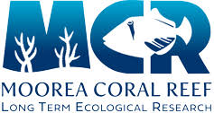

# Mobile invertebrate assemblages assocated w/ a structurally-complex crustose coralline alga (CCA)

This repository holds the data, analyses, and figures for a master's thesis project at California State University, Northridge by Jess Glanz under the advisemnt of Dr. Robert Carpenter. Data were collected in along the northeastern back and fringing coral reefs of Mo'orea, French Polynesia. Data, scripts, and output pertain to an CCA-associated invert assemblage study on high- and low-flow coral reefs. Assemblages are analyzed for size and functional composition in relation to algal morphology and water flow environment.

Folders include:

-Map: Includes data, output, and script files to create maps of collection sites on the northeast shore of Moorea, French Polynesia. The color of points denotes the water flow environment characterizing each site, high water flow (red) and low water flow (orange).

-Assemblage analysis: Includes data, output, and script files to rank and analyze the effects of three known drivers (water flow, algal partial mortality, and algal morphology, including interstitial volume, thallus rugosity, and branch density) to functional composition of associated assemblages. In this study, functional groups were based on average body size and the strategy each phylum employs to grasp onto surfaces since this can affect their flow tolerance and habitat selection.

-Host/Flow Traits: Includes data, output, and script files to analyze the relationship between flow and algal traits and among algal trait data. Algal traits included partial mortality, interstitial volume, rugosity, branch density, width and depth between branches, and branch diameter.
